---

## Stats

<div align="center">


&nbsp;


</div>

<div align="center">


</div>

---



---

## Projects

<table>
<tr>
<td width="50%" valign="top">

### KisanSathi &nbsp;[](https://kisan-sathi-ai.vercel.app)

**AI-Powered Smart Agriculture Platform**

Four ML models trained from scratch on real agricultural datasets, integrated with multiple government and market APIs. Available in English and Hindi.

```
Models:
  ├─ Crop Recommendation
  ├─ Fertilizer Recommendation
  ├─ Rainfall Prediction
  └─ Water Management

Features:
  ├─ Live Mandi (market) price feed
  ├─ Agriculture news — articles + video
  ├─ Ministry of Agriculture resource links
  └─ EN / HI language toggle
```

</td>
<td width="50%" valign="top">

### The Untold Beat &nbsp;[](https://theuntoldbeat.vercel.app)

**Independent Blog Platform**

Built from scratch — no template, no CMS. Custom admin dashboard, rich text editor, animated dark UI.

```
Stack:
  ├─ React + Vite
  ├─ Tailwind CSS
  ├─ Framer Motion
  └─ React Quill (rich text)

Features:
  ├─ Full admin dashboard
  ├─ Rich text article editor
  ├─ Glass-morphism dark UI
  └─ Fully responsive
```

</td>
</tr>
</table>

---

## Contribution Graph

<div align="center">


</div>

---

## Stack

<div align="center">


</div>

---

## Currently

```diff
+ Building ETL pipelines and customer success data infrastructure at scale
+ Expanding KisanSathi — more regional languages, more API integrations
~ Writing about data, systems, and the world at The Untold Beat
```

---

<div align="center">

```
dev@rathi:~$ cat links.txt
──────────────────────────────────────────
github   →  github.com/DevRathi137
platform →  kisan-sathi-ai.vercel.app
blog     →  theuntoldbeat.vercel.app
──────────────────────────────────────────
```

</div>
